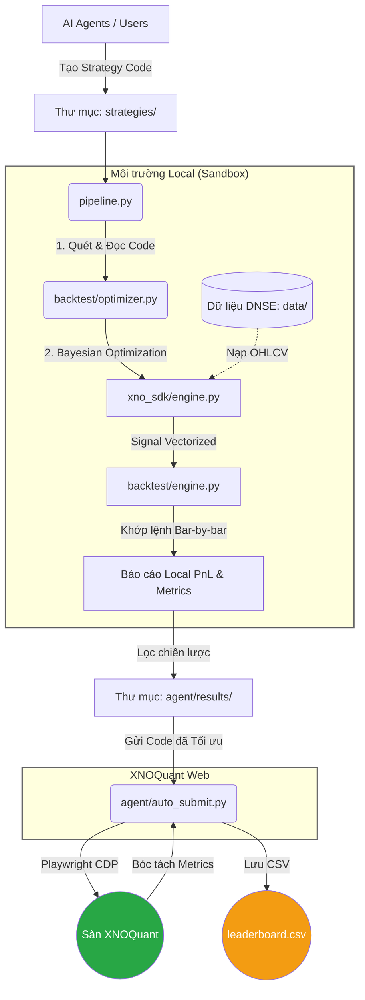

# alpha_farm

Hệ thống cung cấp khung sườn tự động (Auto-Gen Framework) để sinh và thử nghiệm các chiến lược định lượng (Quantitative Strategies) trên thị trường phái sinh Việt Nam, phục vụ nền tảng XNOQuant.

## 1. Kiến trúc Hệ thống (XNOQuant Local Framework)

Hệ thống được thiết kế theo mô hình khép kín: Tự động sinh ý tưởng $\rightarrow$ Gen Code $\rightarrow$ Tối ưu hóa tham số cục bộ $\rightarrow$ Backtest mô phỏng Local $\rightarrow$ Nộp và Trích xuất tự động lên Web XNOQuant.

Để xem thông tin kỹ thuật chuyên sâu về cấu trúc hệ thống và quy định (Rules) của sân chơi XNOQuant, vui lòng tham khảo file `ARCH.md`. Để đọc lại bài học thực chiến, hãy tham khảo `AGENT_EXP.md`.
