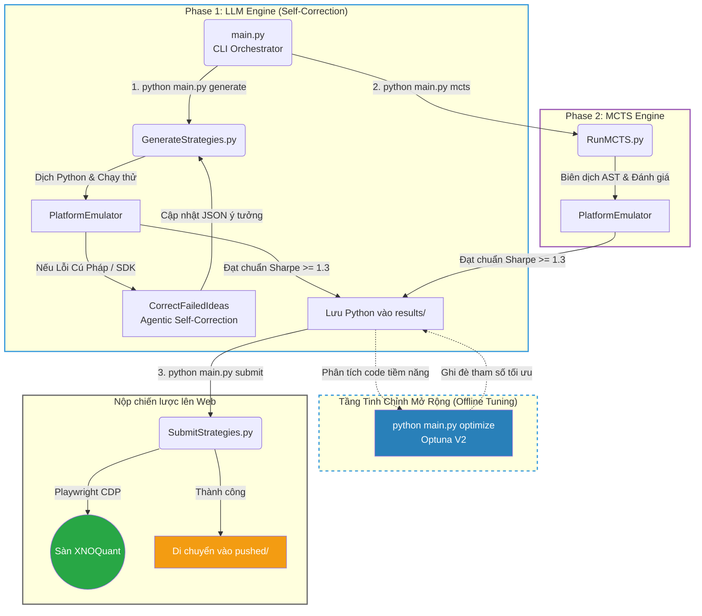

# alpha_farm

Hệ thống cung cấp khung sườn tự động (Auto-Gen Framework) để sinh, tự sửa lỗi, tối ưu hóa và thử nghiệm các chiến lược định lượng (Quantitative Strategies) trên thị trường phái sinh Việt Nam, phục vụ nền tảng XNOQuant.

## 1. Kiến trúc Hệ thống (Dual Engine with Self-Correction)

Hệ thống được thiết kế theo mô hình khép kín gồm 2 động cơ độc lập (LLM Engine và MCTS Engine), được điều khiển tập trung qua `main.py`:



Để xem thông tin kỹ thuật chuyên sâu về cấu trúc hệ thống và quy định (Rules) của sân chơi XNOQuant, vui lòng tham khảo file `ARCH.md`.

---

## 2. Hướng dẫn cài đặt và sử dụng

### Yêu cầu hệ thống
- Python 3.10 trở lên.
- Đã cài đặt Chrome hoặc Edge (để chạy tiện ích Playwright).
- Ollama local (đang chạy nền) nếu sử dụng cơ chế Tự sửa lỗi.

### Cài đặt thư viện
Chạy lệnh sau để cài đặt toàn bộ các thư viện cần thiết:
```bash
pip install -r utilities/deps/deepseek4free/requirements.txt
pip install python-dotenv
```

### Cấu hình API & Tài khoản (.env)
Copy file `.env.example` thành `.env` và điền thông tin tài khoản XNOQuant:
```env
XNO_ACCOUNT=your_email@gmail.com
XNO_PASSWORD=your_password
```
- **Gemini**: Dán cookie lấy từ header vào file `cookies.txt` (nếu dùng mô hình Gemini).
- **DeepSeek**: Đăng nhập vào chat.deepseek.com, mở F12 (Network), sao chép giá trị của `Authorization` header và dán vào file `token.txt` ở thư mục gốc.

---

## 3. Khởi chạy hệ thống (CLI Commands)

Toàn bộ hệ thống nay được điều khiển thông qua một file duy nhất `main.py`. Bạn có thể sử dụng cờ `--help` để xem chi tiết:
```bash
python main.py --help
```

### Cách 1: Chạy Tự Động Toàn Tập (Nhạc Trưởng)
Dành cho việc cắm máy tự động chạy qua toàn bộ quy trình: Sinh ý tưởng $\rightarrow$ Convert $\rightarrow$ Optimize $\rightarrow$ Auto Submit.
```bash
python main.py full --n_strategies 20 --model deepseek-thinking
```

### Cách 2: Chạy Từng Động Cơ Độc Lập
Bạn hoàn toàn có thể chạy riêng từng phần tùy theo nhu cầu để dễ dàng debug và kiểm soát:

- **Săn Alpha bằng MCTS (Không cần AI):** Tự động dò tìm công thức toán học và đánh giá.
  ```bash
  python main.py mcts
  ```
- **Sinh Ý Tưởng bằng LLM (Deepseek/Gemini):** Dùng AI viết kịch bản giao dịch.
  ```bash
  python main.py generate --n_strategies 20 --model deepseek-thinking
  ```
- **Trình Biên Dịch Ý Tưởng hàng loạt:** Dịch file JSON sang Code Python và test Sandbox.
  ```bash
  python main.py convert
  ```

---

## 4. Tinh chỉnh Sức mạnh (Tuning & Optimization)

### Tối ưu hóa tham số (Hyperparameter Tuning)
Bộ tối ưu hóa Optuna thế hệ mới (V2) sử dụng Regex để chỉnh sửa trực tiếp mã nguồn của các chiến lược đạt tiêu chuẩn.
```bash
python main.py optimize --n_trials 30
```

### Tự sửa lỗi Agentic
Chạy vòng lặp tự sửa lỗi bằng mô hình LLM để khôi phục các ý tưởng cũ bị lỗi cú pháp:
```bash
python strategy_workflows/CorrectFailedIdeas.py
```

### MCTS Engine Tuning (`strategy_workflows/RunMCTS.py`)
- **`TIMEFRAMES`**: Mặc định `["10m", "15m", "30m", "60m"]`.
- **`ITERATIONS_PER_DIMENSION`**: Tăng lên `1000`, `5000` hoặc `10000` để đào sâu thuật toán.

---

## 5. Cơ chế chấm điểm nội bộ của MCTS (Reward Function)

Động cơ MCTS sử dụng hệ thống chấm điểm riêng để nhặt ra những công thức toán học tốt nhất. Hàm Reward được thiết kế theo tỷ lệ cân bằng hoàn hảo giữa Khả năng dự đoán, Lợi nhuận và Tính đa dạng nhằm loại bỏ trùng lặp:

**`Reward = 10.0 * abs(RankIC) + Max(0, Sharpe) - 5.0 * MaxCorr`**

**Giải thích các thành phần:**
- **`10.0 * abs(RankIC)`**: Trọng số lớn nhất! Hệ số Rank IC đo lường khả năng tiên tri hướng thị trường của tín hiệu.
- **`Max(0, Sharpe)`**: Thưởng thêm nếu công thức có tỷ lệ Sharpe tốt trong Sandbox.
- **`- 5.0 * MaxCorr`**: Hình phạt (Penalty) **rất nặng** nếu công thức mới sinh ra có nhịp độ mua/bán quá giống (tương quan cao) với các chiến lược đã có sẵn trong danh mục. Việc tăng hệ số phạt tương quan lên `5.0` giúp triệt tiêu hoàn toàn các bản sao vô nghĩa và ép thuật toán liên tục đổi hướng sang các nhánh công thức mới lạ hơn.
