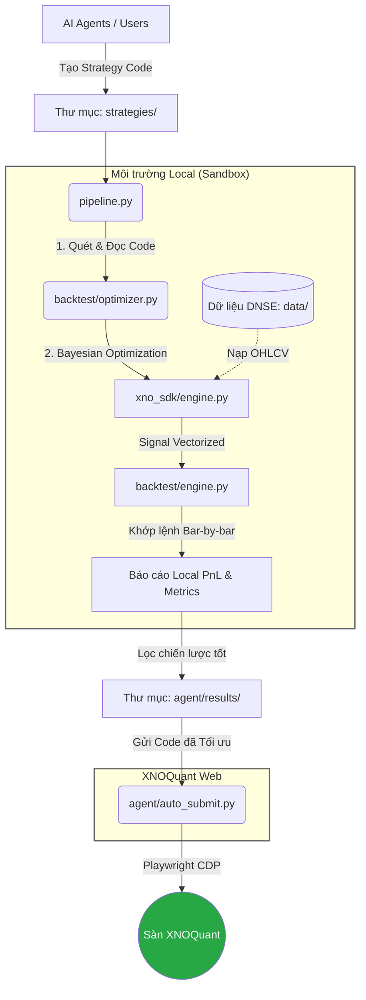

# alpha_farm

## Lịch Sử Nộp Chiến Lược (XNOQuant)

| Tên chiến lược                         | Công thức / Cách hoạt động                                          | Khung | Kết quả |
| -------------------------------------- | ------------------------------------------------------------------- | ----- | ------- |
| **MeanRev_CCI_LinearReg**              | Đảo chiều. LR Slope = sideway. Bắt đáy/đỉnh bằng CCI.               | 30m   | ✅ PASS |
| **Momentum_LinRegAngle_AroonOsc**      | Động lượng. LR Angle = đo độ dốc. Aroon = xác nhận xu hướng.        | 15m   | ✅ PASS |
| **Volatility_BBands_DEMA_Filter**      | Phá vỡ biến động. BBands nén. DEMA lọc xu hướng chính.              | 30m   | ❌ FAIL |
| **Breakout_SAR_ADX_Volatility**        | Phá vỡ cản động. Parabolic SAR = cản. ADX = lọc xu hướng mạnh.      | 30m   | ✅ PASS |
| **Session_PriceChannel_ROC_Filter**    | Breakout phiên sáng. ROC đo động lực xu hướng ngày.                 | 30m   | ❌ FAIL |
| **Trend_T3_UltOsc_VolumeOsc**          | Xu hướng trung hạn. Đường T3. Ultimate Osc + ADOSC lọc volume.      | 30m   | ❌ FAIL |
| **Trend_Tema_Aroon_StdDev_Filter**     | Bám xu hướng. Trục TEMA. Aroon + StdDev lọc sideway.                | 30m   | ✅ PASS |
| **Channel_KAMA_StdDev_CMO_Breakout**   | Kênh giá. Trục KAMA + biên StdDev. Đột phá biên + CMO xác nhận.     | 10m   | ✅ PASS |
| **Pattern_Marubozu_TEMA_RSI_Breakout** | Mô hình nến. Nến cường lực Marubozu. TEMA xu hướng + RSI lọc nhiễu. | 30m   | ❌ FAIL |

## Kiến trúc Hệ thống (XNOQuant Local Framework)

Hệ thống được thiết kế theo quy trình khép kín: Tự động sinh chiến lược -> Tối ưu hóa tham số -> Backtest mô phỏng Local -> Nộp tự động lên XNOQuant.

