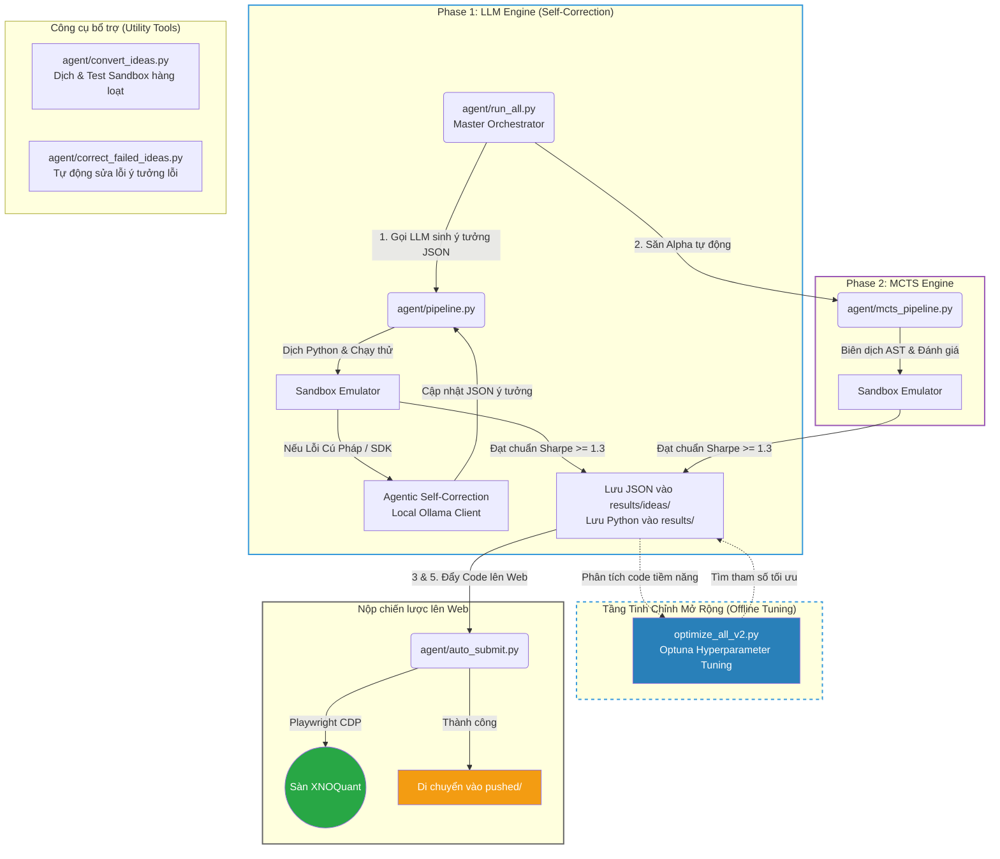

# alpha_farm

Hệ thống cung cấp khung sườn tự động (Auto-Gen Framework) để sinh, tự sửa lỗi, tối ưu hóa và thử nghiệm các chiến lược định lượng (Quantitative Strategies) trên thị trường phái sinh Việt Nam, phục vụ nền tảng XNOQuant.

## 1. Kiến trúc Hệ thống (Dual Engine with Self-Correction)

Hệ thống được thiết kế theo mô hình khép kín gồm 2 động cơ độc lập (LLM Engine và MCTS Engine), tích hợp sẵn **Vòng lặp tự sửa lỗi (Agentic Self-Correction)**:



Để xem thông tin kỹ thuật chuyên sâu về cấu trúc hệ thống và quy định (Rules) của sân chơi XNOQuant, vui lòng tham khảo file `ARCH.md`.

---

## 2. Hướng dẫn cài đặt và sử dụng

### Yêu cầu hệ thống
- Python 3.10 trở lên.
- Đã cài đặt Chrome hoặc Edge (để chạy tiện ích Playwright).
- Ollama local (đang chạy nền) nếu sử dụng cơ chế Tự sửa lỗi.

### Cài đặt thư viện
Chạy lệnh sau để cài đặt toàn bộ các thư viện cần thiết:
```bash
pip install -r agent/util/deepseek4free/requirements.txt
```

### Cấu hình API Token
1. **DeepSeek**: Đăng nhập vào [chat.deepseek.com](https://chat.deepseek.com), mở F12 (Network), sao chép giá trị của `Authorization` header và dán vào file `token.txt` ở thư mục gốc.
2. **Gemini**: Dán cookie lấy từ header vào file `cookies.txt` (nếu dùng mô hình Gemini).

---

## 3. Khởi chạy hệ thống

### Cách 1: Chạy Tự Động Toàn Tập (Nhạc Trưởng)
Chỉ cần chạy file `run_all.py`, hệ thống sẽ mở **Menu Cấu Hình Tương Tác (Interactive CLI)** cho phép bạn:
- Dùng mũi tên Lên/Xuống để chọn Model AI (Gemini, DeepSeek, Local Ollama).
- Nhập số lượng chiến lược AI cần tạo và số vòng lặp MCTS (nhập `0` để bỏ qua MCTS).

Lưu ý: Hệ thống được trang bị cơ chế **Fail-Fast**, sẽ chặn đứng và dừng lập tức nếu xảy ra lỗi API/hệ thống nghiêm trọng để tránh chạy vòng lặp vô ích.
```bash
python agent/run_all.py
```

### Cách 2: Chạy Từng Động Cơ Độc Lập
Do thiết kế module rời rạc, bạn hoàn toàn có thể chạy riêng từng phần tùy theo nhu cầu:
- **Săn Alpha bằng MCTS (Không cần AI):** Tự động dò tìm công thức toán học và đánh giá.
  ```bash
  python agent/mcts_pipeline.py
  ```
- **Sinh Ý Tưởng bằng LLM (Deepseek/Gemini):** Dùng AI viết kịch bản giao dịch ra file JSON.
  ```bash
  python agent/pipeline.py
  ```
- **Trình Biên Dịch Ý Tưởng hàng loạt:** Dịch file JSON trong `ideas` sang Code Python và test Sandbox.
  ```bash
  python agent/convert_ideas.py
  ```
- **Sửa lỗi tự động cho các ý tưởng lỗi:** Chạy vòng lặp tự sửa lỗi bằng mô hình local Ollama để khôi phục toàn bộ các file ý tưởng cũ bị lỗi cú pháp/TA-Lib:
  ```bash
  python agent/correct_failed_ideas.py
  ```

---

## 4. Tinh chỉnh Sức mạnh (Tuning & Optimization)

### Tối ưu hóa tham số (Hyperparameter Tuning)
Sau khi chiến lược được tạo và biên dịch thành công, chạy lệnh dưới đây để tối ưu hóa bộ tham số bằng Optuna (Bayesian Optimization):
- Script sẽ tự động nhận diện tham số, chạy 30 trials tối ưu hóa `total_return_pct` và ghi đè giá trị tối ưu vào code.
- Áp dụng bộ lọc V2 (Sharpe > 1.3, CAGR > 15%). Bỏ qua các khung thời gian quá ngắn (`1m`, `5m`) để tránh bị ăn mòn lợi nhuận bởi phí giao dịch.
```bash
python optimize_all_v2.py
```

### MCTS Engine Tuning (`agent/mcts_pipeline.py`)
- **`TIMEFRAMES`**: Mặc định `["10m", "15m", "30m", "60m"]`.
- **`ITERATIONS_PER_DIMENSION`**: Tăng lên `1000`, `5000` hoặc `10000` để đào sâu thuật toán.
- **`max_depth` (độ sâu cây AST)**: Nằm ở dòng khởi tạo `MCTSEngine(..., max_depth=3)`. Tăng lên `4` hoặc `5` nếu muốn công thức dài và phức tạp hơn.

---

## 5. Cơ chế chấm điểm nội bộ của MCTS (Reward Function)

Động cơ MCTS sử dụng hệ thống chấm điểm riêng để nhặt ra những công thức toán học tốt nhất. Hàm Reward được thiết kế theo tỷ lệ cân bằng hoàn hảo giữa Khả năng dự đoán, Lợi nhuận và Tính đa dạng nhằm loại bỏ trùng lặp:

**`Reward = 10.0 * abs(RankIC) + Max(0, Sharpe) - 5.0 * MaxCorr`**

**Giải thích các thành phần:**
- **`10.0 * abs(RankIC)`**: Trọng số lớn nhất! Hệ số Rank IC đo lường khả năng tiên tri hướng thị trường của tín hiệu.
- **`Max(0, Sharpe)`**: Thưởng thêm nếu công thức có tỷ lệ Sharpe tốt trong Sandbox.
- **`- 5.0 * MaxCorr`**: Hình phạt (Penalty) **rất nặng** nếu công thức mới sinh ra có nhịp độ mua/bán quá giống (tương quan cao) với các chiến lược đã có sẵn trong danh mục. Việc tăng hệ số phạt tương quan lên `5.0` giúp triệt tiêu hoàn toàn các bản sao vô nghĩa (như các biến thể làm mượt ATR hay NATR) và ép thuật toán liên tục đổi hướng sang các nhánh công thức mới lạ hơn.
