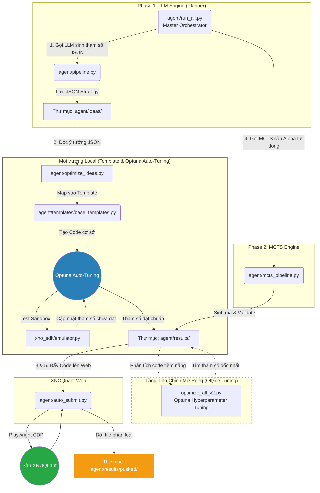

# alpha_farm

Hệ thống cung cấp khung sườn tự động (Auto-Gen Framework) để sinh và thử nghiệm các chiến lược định lượng (Quantitative Strategies) trên thị trường phái sinh Việt Nam, phục vụ nền tảng XNOQuant.

## 1. Kiến trúc Hệ thống (Dual Engine Framework)

Hệ thống được thiết kế theo mô hình khép kín với 2 động cơ độc lập (LLM Engine và MCTS Engine):



Để xem thông tin kỹ thuật chuyên sâu về cấu trúc hệ thống và quy định (Rules) của sân chơi XNOQuant, vui lòng tham khảo file `ARCH.md`.

## 2. Hướng dẫn cài đặt và sử dụng

### Yêu cầu hệ thống
- Python 3.10 trở lên.
- Đã cài đặt Chrome hoặc Edge (để chạy tiện ích Playwright).

### Cài đặt thư viện
Chạy lệnh sau để cài đặt toàn bộ các thư viện cần thiết:
```bash
pip install -r agent/util/deepseek4free/requirements.txt
```

### Cấu hình API Token
1. **DeepSeek**: Đăng nhập vào [chat.deepseek.com](https://chat.deepseek.com), mở F12 (Network), sao chép giá trị của `Authorization` header và dán vào file `token.txt` ở thư mục gốc.
2. **Gemini**: Dán cookie lấy từ header vào file `cookies.txt` (nếu dùng mô hình Gemini).

### Khởi chạy hệ thống

**Cách 1: Chạy Tự Động Toàn Tập (Nhạc Trưởng)**
Chỉ cần chạy file `run_all.py`, hệ thống sẽ mở **Menu Cấu Hình Tương Tác (Interactive CLI)** cho phép bạn:
- Dùng mũi tên Lên/Xuống để chọn Model AI (Gemini, DeepSeek, Local Ollama).
- Nhập số lượng chiến lược AI cần tạo và số vòng lặp MCTS (nhập `0` để bỏ qua MCTS).

Hệ thống cũng được trang bị cơ chế **Fail-Fast**, sẽ chặn đứng và dừng lập tức nếu xảy ra lỗi API/hệ thống nghiêm trọng ở bất kỳ Phase nào thay vì chạy vòng lặp vô ích.
```bash
python agent/run_all.py
```

**Cách 2: Chạy Từng Động Cơ Độc Lập**
Do thiết kế module rời rạc, bạn hoàn toàn có thể chạy riêng từng phần tùy theo nhu cầu:
- **Săn Alpha bằng MCTS (Không cần AI):** Tự động dò tìm công thức toán học và lưu file.
  ```bash
  python agent/mcts_pipeline.py
  ```
- **Sinh Ý Tưởng bằng LLM (Gemini/Deepseek/Ollama):** Dùng AI để lên kế hoạch và sinh tham số giao dịch ra file JSON. (Vẫn hỗ trợ tùy chọn dùng Model Local để sinh ý tưởng).
  ```bash
  python agent/pipeline.py
  ```
- **Tối Ưu Hoá & Cấu Hình Tự Động:** Đưa tham số JSON vào Template, chạy Backtest và tự động dùng Optuna để dò tìm bộ tham số tối ưu nếu chưa đạt chuẩn (Sharpe > 1.3 và CAGR > 15%).
  ```bash
  python agent/optimize_ideas.py
  ```
- **Chuyển đổi Ý Tưởng Cũ (Legacy Conversion):** Dùng mô hình Local (Ollama) để phân tích và ánh xạ các file ý tưởng JSON cũ (không theo chuẩn) sang cấu trúc Template tĩnh.
  ```bash
  python agent/convert_legacy_ideas.py
  ```

**Lưu ý khi chạy DeepSeek:**
Nếu bạn nhận được lỗi `CloudflareError`, hãy chạy lệnh sau để lấy cookie vượt tường lửa tự động:
```bash
python -m dsk.bypass
```

## 3. Hướng dẫn Tinh chỉnh Sức mạnh (Tuning)

Để vắt kiệt tối đa sức mạnh của hệ thống (đặc biệt là MCTS Engine), bạn có thể mở các file cấu hình và tinh chỉnh (TWEAK) các hằng số sau:

### MCTS Engine Tuning (`agent/mcts_pipeline.py`)
- **`TIMEFRAMES`**: Mặc định `["10m", "15m", "30m", "60m"]`. Bạn có thể bổ sung `"5m"`, `"1h"`, `"1d"` để MCTS săn Alpha trên nhiều địa hình hơn.
- **`ITERATIONS_PER_DIMENSION`**: Mặc định `150`. Tăng lên `1000`, `5000` hoặc `10000` để đào sâu thuật toán. Số càng lớn, công thức tìm ra càng sắc bén, nhưng bù lại sẽ tốn nhiều RAM và CPU.
- **`POSITION_SCALES`**: Mặc định `[0.2, 0.3, 0.4, 0.1]`. Bạn có thể băm nhỏ các nấc scale (VD: `[0.05, 0.1, 0.15, ...]`) để hệ thống linh hoạt hơn trong quản trị rủi ro.
- **`max_depth` (độ sâu AST)**: Nằm ở dòng khởi tạo `MCTSEngine(..., max_depth=3)`. Tăng lên `4` hoặc `5` nếu bạn muốn những công thức toán học dài và dị (cẩn thận vì dài quá dễ bị Overfitting hoặc vi phạm luật quá 6 tham số).

### LLM Pipeline Tuning
- **Mô hình AI Local (Ollama):** Vẫn được hỗ trợ đầy đủ để đóng vai trò làm bộ não chính lên kế hoạch sinh ý tưởng chiến lược (Planner/Generator). Quá trình tinh chỉnh tham số ở hậu trường đã được chuyển giao hoàn toàn cho Optuna để đạt tốc độ tối đa và tiết kiệm tài nguyên.
- **Số lượng chiến lược:** Được tinh chỉnh dễ dàng ngay trên giao diện dòng lệnh của `run_all.py` (Tham số `n_strategies` và `mcts_iter`). Không cần can thiệp trực tiếp vào mã nguồn.

## 4. Cơ chế chấm điểm nội bộ của MCTS (Reward Function)

Động cơ MCTS sử dụng một hệ thống chấm điểm riêng để tự động nhặt ra những công thức toán học tốt nhất trong số hàng trăm ngàn biến thể. Hàm Reward này được thiết kế theo tỷ lệ cân bằng hoàn hảo giữa Khả năng dự đoán, Lợi nhuận và Tính đa dạng:

**`Reward = 10.0 * abs(RankIC) + Max(0, Sharpe) - 2.0 * MaxCorr`**

**Giải thích các thành phần:**
- **`10.0 * abs(RankIC)`**: Trọng số lớn nhất! Hệ số Rank IC đo lường khả năng dự đoán đúng hướng thị trường (tương quan xếp hạng giữa tín hiệu hiện tại và lợi nhuận nến tương lai). Việc nhân với `10.0` đưa giá trị này về mức đóng góp khoảng `0.2` đến `0.8` điểm. Nó giúp bảo vệ những công thức có "sức mạnh tiên tri" tốt.
- **`Max(0, Sharpe)`**: Thưởng thêm từ `0` đến khoảng `2.0` điểm nếu công thức có tỷ lệ Lợi nhuận/Rủi ro (Sharpe) tốt trong môi trường Sandbox. Việc dùng hàm `Max(0, ...)` thay vì để âm giúp bảo vệ các công thức tiềm năng khỏi bị vứt bỏ chỉ vì trót giao dịch quá nhiều khiến phí (Fee) ăn mòn lợi nhuận.
- **`- 2.0 * MaxCorr`**: Hình phạt (Penalty) nặng (trừ đi khoảng `-0.4` đến `-1.8` điểm) nếu công thức mới sinh ra có nhịp độ mua/bán quá giống (Correlation cao) với các Alpha đã có sẵn trong danh mục. Nhờ đó, máy học MCTS bị ép buộc phải liên tục đổi hướng để tìm tòi các nhánh công thức dị và độc lạ hơn.

Cả 3 thành phần này đều đã được tinh chỉnh hệ số (Scale) để cùng nằm trên một mặt bằng điểm số. Tạo ra một "công lý toán học" giúp hệ thống luôn hướng về phía các **Alpha Đa Dạng (Diverse)** và **Hiệu Quả (Effective)**.
