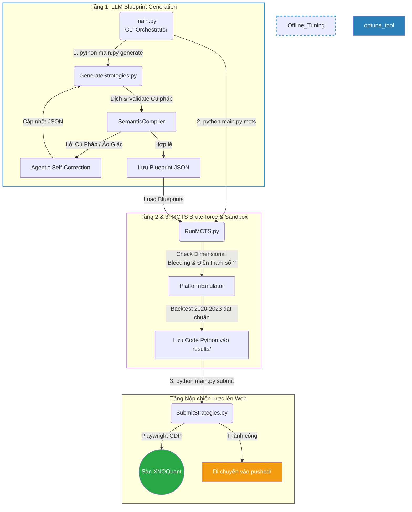

# alpha_farm

Hệ thống cung cấp khung sườn tự động (Auto-Gen Framework) để sinh, tự sửa lỗi, tối ưu hóa và thử nghiệm các chiến lược định lượng (Quantitative Strategies) trên thị trường phái sinh Việt Nam, phục vụ nền tảng XNOQuant.

## 1. Kiến trúc Hệ thống (Dual Engine with Self-Correction)

Hệ thống được thiết kế theo mô hình khép kín gồm 2 động cơ độc lập (LLM Engine và MCTS Engine), được điều khiển tập trung qua `main.py`:



Để xem thông tin kỹ thuật chuyên sâu về cấu trúc hệ thống và quy định (Rules) của sân chơi XNOQuant, vui lòng tham khảo file `ARCH.md`.

---

## 2. Hướng dẫn cài đặt và sử dụng

### Yêu cầu hệ thống
- Python 3.10 trở lên.
- Đã cài đặt Chrome hoặc Edge (để chạy tiện ích Playwright).
- Ollama local (đang chạy nền) nếu sử dụng cơ chế Tự sửa lỗi.

### Cài đặt thư viện
Chạy lệnh sau để cài đặt toàn bộ các thư viện cần thiết:
```bash
pip install -r utilities/deps/deepseek4free/requirements.txt
pip install python-dotenv
```

### Cấu hình API & Tài khoản (.env)
Copy file `.env.example` thành `.env` và điền thông tin tài khoản XNOQuant:
```env
XNO_ACCOUNT=your_email@gmail.com
XNO_PASSWORD=your_password
```
- **Gemini**: Dán cookie lấy từ header vào file `cookies.txt` (nếu dùng mô hình Gemini).
- **DeepSeek**: Đăng nhập vào chat.deepseek.com, mở F12 (Network), sao chép giá trị của `Authorization` header và dán vào file `token.txt` ở thư mục gốc.

---

## 3. Khởi chạy hệ thống (CLI Commands)

Toàn bộ hệ thống nay được điều khiển thông qua một file duy nhất `main.py`. Bạn có thể sử dụng cờ `--help` để xem chi tiết:
```bash
python main.py --help
```

### Cách 1: Chạy Tự Động Toàn Tập (Nhạc Trưởng)
Dành cho việc cắm máy tự động chạy qua toàn bộ quy trình 3 Tầng: Sinh ý tưởng (Generate) $\rightarrow$ Tìm kiếm thông số MCTS (MCTS) $\rightarrow$ Auto Submit.
```bash
python main.py full --n_strategies 20 --model deepseek-thinking
```

### Cách 2: Chạy Từng Động Cơ Độc Lập
Bạn hoàn toàn có thể chạy riêng từng phần tùy theo nhu cầu để dễ dàng debug và kiểm soát:

- **Săn Alpha bằng MCTS (Không cần AI):** Tự động dò tìm công thức toán học và đánh giá.
  ```bash
  python main.py mcts
  ```
- **Sinh Ý Tưởng bằng LLM (Deepseek/Gemini):** Dùng AI viết kịch bản giao dịch dạng khung cấu trúc (Blueprint JSON).
  ```bash
  python main.py generate --n_strategies 20 --model deepseek-thinking
  ```
- **Tầng 2 & 3 (Compiler & MCTS):** Đọc các Blueprint JSON, biên dịch, tìm kiếm MCTS Brute-force để lắp thông số, đánh giá bằng Sandbox Sandbox và xuất ra file Code Python hoàn chỉnh.
  ```bash
  python main.py mcts
  ```

---

## 4. Tinh chỉnh Sức mạnh (Tuning & Optimization)

### Tự sửa lỗi Inline (Agentic Self-Correction)
Quá trình tự sửa lỗi hiện tại đã được tích hợp trực tiếp **(Inline)** vào Tầng 1 (`GenerateStrategies.py`). 
Ngay khi LLM sinh ra một Blueprint bị sai cú pháp hoặc sai thứ nguyên, `SemanticCompiler` sẽ ném lỗi và bắt LLM (Local model) sửa ngay lập tức trong bộ nhớ mà không cần lưu ra file riêng lẻ. Bạn không cần phải chạy kịch bản sửa lỗi thủ công như kiến trúc cũ.

### MCTS Engine Tuning (`strategy_workflows/RunMCTS.py`)
MCTS thay thế hoàn toàn hệ thống Optuna cũ. MCTS Brute-force không chỉ tối ưu tham số mà còn tự động khám phá và xây dựng cây biểu thức toán học (AST).
Bạn có thể tinh chỉnh sức mạnh bằng cách cấu hình số vòng lặp:
- **`MCTS_ITERATIONS`**: Tăng số vòng lặp để đào sâu vào các nhánh tham số phức tạp.

---

## 5. Cấu hình Model & Context Caching

Hệ thống hỗ trợ tự động Cache (bộ nhớ đệm) cho các LLM chạy trên máy cục bộ (như vLLM, Ollama) giúp tốc độ sinh chiến lược cực kỳ nhanh. 
Bạn có thể cấu hình chọn model trực tiếp qua tham số dòng lệnh:

```bash
# Chạy mô hình tư duy đám mây
python main.py generate --model deepseek-thinking

# Chạy mô hình tốc độ cao nội bộ (đã tối ưu Context Caching)
python main.py generate --model ollama-9b
```

---

## 6. Cơ chế chấm điểm nội bộ của MCTS (Reward Function)

Động cơ MCTS Brute-force sử dụng hệ thống chấm điểm riêng để nhặt ra những công thức toán học tốt nhất. Hàm Reward hiện tại tập trung vào Lợi nhuận và Sức mạnh dự báo gốc:

**`Reward = 10.0 * abs(RankIC) + Max(0, Sharpe)`**

**Giải thích các thành phần:**
- **`10.0 * abs(RankIC)`**: Trọng số lớn nhất! Hệ số Rank IC đo lường khả năng tiên tri hướng đi của thị trường của tín hiệu.
- **`Max(0, Sharpe)`**: Thưởng thêm nếu công thức có tỷ lệ Sharpe tốt (lợi nhuận thực tế) khi chạy qua Sandbox.

**Đặc biệt - Risk-Seeking UCT Optimization:** 
Khi duyệt cây tìm kiếm (UCT), MCTS không sử dụng điểm trung bình (Mean Reward) mà sử dụng **Điểm lớn nhất (Max Reward)**. Đây là kỹ thuật "Tail Quantile Optimization", chấp nhận sự không ổn định để tìm ra những chuỗi tham số "đột biến" mang lại hiệu suất cao nhất.
Các nhánh công thức vô dụng sẽ bị loại bỏ thông qua cơ chế cấm tự động (FSA Forbidden Patterns / Linear Amnesia Mitigation).
